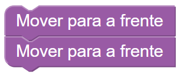
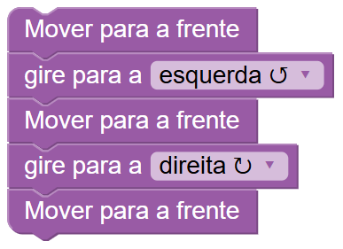
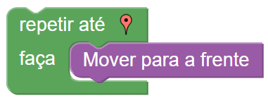
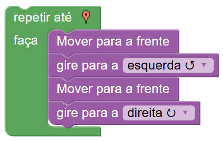
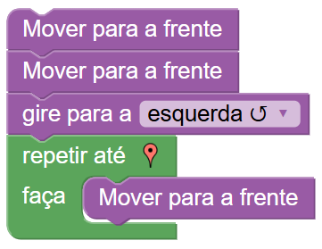
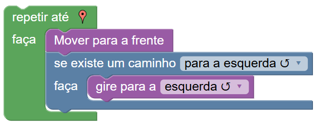
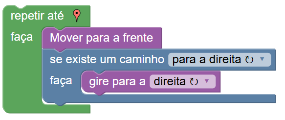
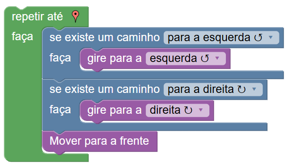
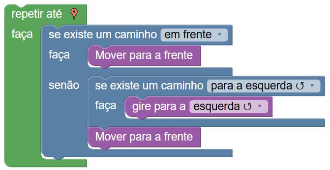
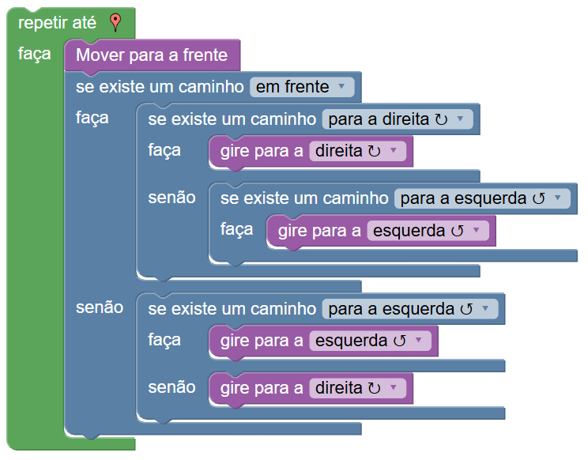

# Blockly Maze

Esta adaptação do *Blocky Maze (by GOOGLE)* trata-se de um desafio Capture The Flag para o *CoderCamp '25 (by CoderDojo UMinho)*.
>NOTA: O *Blockly Maze* é uma série de desafios de resolução de labirintos com recurso a um editor de código visual (em blocos).

## Link (URL)
https://www.marcoslobo.xyz/maze

## Flag
A flag deste CTF só é obtida após completar o nível 10.
**CD25**{Labirintos-Resolvidos}

## Soluções

### Nível 1

### Nível 2

### Nível 3

### Nível 4

### Nível 5

### Nível 6

### Nível 7

### Nível 8

### Nível 9

### Nível 10

## Licenças
[Original LICENSE](https://github.com/google/blockly/blob/develop/LICENSE)
*Segundo os mesmos termos da licença acima (Apache 2.0), Marcos Bernardo da Silva Lobo (25/06/2025) partilha uma adaptação (Capture The Flag) do Blockly Maze.*