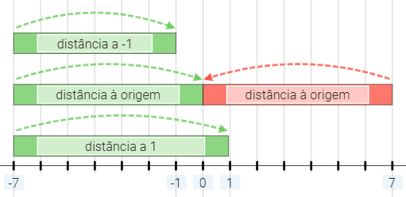

# Descobre o número secreto

O objetivo deste desafio é escrever uma função que adivinhe um número secreto.

Tens apenas acesso a uma outra função (que não consegues ver) que te diz a distância de um dado número ao número secreto (que não consegues ver e apenas o avaliador conhece).

Supõe por exemplo que o número secreto era 10. Se perguntasses à função oculta qual a distância de 8 para o número secreto, ela devolver-te-ia 2. Se, por outro lado, perguntasses qual a distância de 13 para o número secreto, esta seria 3 (consideramos a distância sempre positiva).

## Função segredo.distancia(N)

Para saberes a distância de um determinado número N, inteiro, para o número secreto (também inteiro), deverás chamar a função **segredo.distancia(N)**.

Para tornar o problema mais desafiante, esta função **só aceita números entre -50 e 50**. No entanto, **o número secreto pode estar fora deste intervalo**.

## Resolução

A dificuldade deste exercício não é escrever código, que são 5-7 linhas simples, a dificuldade é perceber que código escrever. Para isso recomendamos que pegues numa folha de papel e num lápis e tentes perceber de que forma é que, a partir da informação que a função segredo.distancia(x) te dá. Relembrar que os números fornecidos como argumento à função segredo.distancia(x) têm que estar entre -50 e 50, inclusive.

## Solução

Os ninjas devem usar a função segredo.distancia(N) para descobrir o valor e o sinal do número secreto.

>NOTA: segredo.distancia(0) representa o valor absoluto do número secreto.

>NOTA: sabendo o valor absoluto do número secreto, e segredo.distancia(-1), se a distância a -1 for menor que a distância a 0, o número é negativo, senão é positivo.

### Referencial

## Flag
A flag deste CTF só é obtida se a função funcionar como esperado.

**CD25**{descobriste-o-numero-secreto}